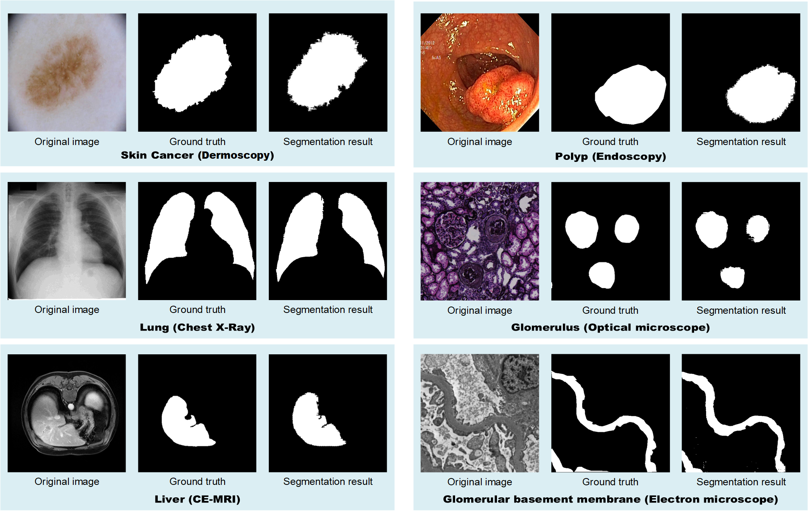

<h1> Segment Any Tissue: One-Shot Reference Guided Training-Free Dual-Space Prompting for Universal Medical Image Segmentation </h1>

[Xueyu Liu]([https://scholar.google.com/citations?user=9JcQ2hwAAAAJ&hl=en](https://scholar.google.com.hk/citations?user=jeatLqIAAAAJ&hl=zh-CN))1, &nbsp; 
Guangze Shi1, &nbsp; 
Rui Wang2, &nbsp; 
Yexin Lai1, &nbsp; 
Jianan Zhang1, &nbsp; 
Xinyu Wang3, &nbsp;
Weixia Han3, &nbsp;
Ming Li1, &nbsp;
Xiaoshuang Zhou4, &nbsp;
Yonfei Wu1*, &nbsp;
Chen Wang3, &nbsp;
Wen Zheng1

1[Taiyuan University of Technology](https://www.tyut.edu.cn/), &nbsp;
2[University of Science and Technology of China](https://www.ustc.edu.cn/), &nbsp;
3[The Second Affiliated Hospital of Shanxi Medical University](https://www.sydey.com/)，&nbsp;
4[Shanxi Provincial People's Hospital](https://www.sxsrmyy.com/)

## Overview

##  Description
In the field of medical imaging, AI-driven technologies have historically faced limitations due to the high costs and complexities associated with training, especially in image segmentation. To address these challenges, we present Segment Any Tissue (SAT), an innovative training-free framework designed to automatically prompt the class-agnostic visual foundation model for the segmentation of medical images with exceptional efficiency. SAT leverages the robust feature matching capabilities of the pretrained foundation model to generate initial prompt points. It then introduces a series of novel automatic prompt engineering techniques across feature and physical spaces to optimize the prompt scheme. Finally, SAT utilizes a class-agnostic foundation segmentation model with the generated prompt scheme to achieve accurate segmentation results. Our method has been validated on four public datasets ranging from macro to micro scales and two private datasets. Results demonstrate superior performance compared to existing one-shot methods, requiring only one labeled reference image in a training-free manner. Ablation experiments further confirm the effectiveness of each component of the automatic prompt engineering. In summary, SAT introduces a unique automatic prompt framework that enables robust, domain-independent, universal segmentation performance without the need for training. This significantly advances the automatic prompting of foundation segmentation models for medical images. SAT introduces a brand-new paradigm for medical image segmentation, laying a solid foundation for the clinical application of intelligent medicine.
## Setup 
- Cuda 12.0
- Python 3.9.18
- PyTorch 2.0.0

## TODO
- [ ] Release code

## Acknowledgement
Thanks [DINOv2](https://github.com/facebookresearch/dinov2), [SAM](https://github.com/facebookresearch/segment-anything), [GBMSeg](https://github.com/SnowRain510/GBMSeg). for serving as building blocks of SAT.
